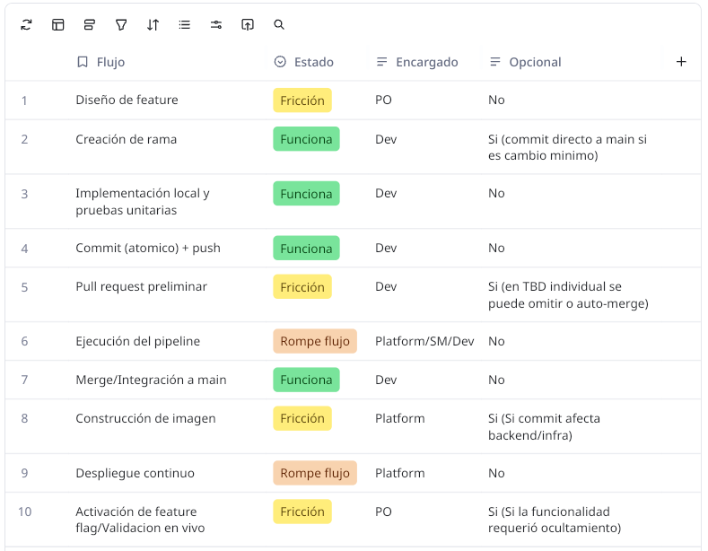

# Scrum + TBD Playbook
**Repositorio:** `D4N-1/git-course`  
**Modalidad:** Individual

---

## 1. Diagnóstico del Flujo de Trabajo

### Preguntas Clave
- **¿Cuánto vive una rama?**
En TBD individual, una rama corta vive menos de 24 horas; los cambios mínimos pueden integrarse directamente a `main` tras validación local.
- **¿Con qué frecuencia integras a main?**
Mínimo 1 o 2 veces al día.
- **¿El DoD garantiza que main sea siempre desplegable?**
Sí. Nada entra a `main` si rompe la compilación/tests, y cualquier trabajo incompleto se protege mediante Feature Flags.

### Mapa del Flujo Actual y Puntos de Fricción

> *Haz clic en la imagen para abrir el tablero interactivo en Miro*

---

## 2. Roles Adaptados (Enfoque Individual)

- **Product Owner (PO):**
  - Divide los issues en entregas verticales pequeñas (batches de < 1 día)
  - Define los criterios de aceptación verificables en producción y la estrategia de Feature Flags
  > **Compromiso (PO):** *"A partir de hoy, no crearé issues monolíticos; desglosaré cada funcionalidad en historias mínimas que puedan viajar a main ocultas tras un flag y validarse en producción sin esperar al final de un sprint."*

- **Developer:**
  - Mantiene `main` siempre verde; si CI falla, detiene el desarrollo nuevo hasta reparar la rama principal
  - Realiza commits atómicos y agrega pruebas automatizadas que respalden cada cambio
  > **Compromiso (Developer):** *"A partir de hoy, no acumularé más de un día de trabajo en local ni mantendré ramas vivas por más de 24 horas; integraré cambios pequeños respaldados por tests para garantizar que main sea siempre desplegable."*

- **Scrum Master / Platform:**
  - Configura y hace cumplir las Branch Protection Rules en GitHub
  - Optimiza los workflows de GitHub Actions para que el pipeline de feedback tarde menos de 5 minutos
  - Elimina la fricción y el miedo a romper el entorno mediante reversiones rápidas y automatización
  > **Compromiso (Scrum Master / Platform):** *"A partir de hoy, priorizaré la salud y velocidad del pipeline sobre nuevas características; si el CI tarda demasiado o falla, protegeré el tiempo necesario para arreglar la automatización antes de seguir construyendo."*
---

## 3. Artefactos y Ceremonias Adaptados

### 3.1 Tabla Comparativa (Clásico vs. TBD + CD)

| Artefacto / Ceremonia | Versión clásica | Adaptación TBD + CD |
| :--- | :--- | :--- |
| **Product Backlog** | Lista priorizada de historias | Historias sliceadas + plan de Feature Toggle + AC validables en producción |
| **Sprint Backlog** | Trabajo del sprint | Trabajo que se planea integrar a `main` (idealmente a diario) |
| **Incremento** | Al final del sprint | Cualquier commit en `main` que pase CI es un Incremento potencial |
| **Daily Scrum** | Qué hice / haré / impedimentos | Qué voy a integrar hoy a `main` y qué necesito para que sea seguro |
| **Sprint Review** | Demo del incremento del sprint | Demo de lo que ya está (o puede estar) en producción + feedback real |
| **Sprint Retrospective** | Mejorar el proceso | Mejorar flujo de valor + salud del pipeline + disciplina de TBD |

### 3.2 Actividad: Traduce tu Realidad (Historia de Usuario Reescrita para TBD)

#### Historia de Usuario: HU-01 - Operación Resta con Feature Flag en Calculadora

* **Título:** Implementación del método de sustracción en `Calculator` bajo Flag (Dark Launch).
* **Descripción:**  
  **Como** desarrollador del sistema,  
  **Quiero** integrar la lógica matemática del método `resta()` en la clase `Calculator` (`main.py`) manteniendo la funcionalidad inactiva mediante un Feature Flag en ConfigCat al 0% de rollout,  
  **Para** integrar código frecuentemente a la rama principal (`main`) sin exponer funcionalidades incompletas a los usuarios finales ni generar regresiones en producción.

---

#### 1. Sliceado Vertical (Estrategia de Batch Pequeño)
- **Tamaño estimado:** < 1 día de trabajo (integrable en menos de 24 horas).
- **Alcance:** Solo lógica de negocio interna (`Calculator.resta`) y suite de pruebas unitarias (`tests.py`).
- **Exclusión explícita:** No se modifica la interfaz gráfica / CLI / API expuesta al usuario.

---

#### 2. Plan de Feature Toggle (ConfigCat)
- **Flag Key:** `isSubtractionEnabled` (o `feature_subtraction`).
- **Estado inicial:** `OFF` / Desactivado (Rollout al 0% en ConfigCat).
- **Estrategia en código:**
  - El método o su invocación valida el estado del toggle mediante el SDK de ConfigCat.
  - Si el flag está en `False` (comportamiento por defecto en producción), la funcionalidad permanece oculta o retorna una excepción controlada/comportamiento heredado sin afectar los métodos existentes (`suma`, etc.).
  - En pruebas locales (`tests.py`), se mockea el cliente de ConfigCat para validar tanto el camino con flag en `True` como en `False`.

---

#### 3. Criterios de Aceptación (AC) Validables en Producción / Main
- [ ] **Lógica implementada:** El método `resta(a, b)` está definido en `Calculator` dentro de `main.py` y resuelve sustracciones aritméticas correctamente.
- [ ] **Cobertura de pruebas:** Se añaden casos de prueba en `tests.py` que verifican la resta y el comportamiento dependiente del Feature Flag.
- [ ] **Salud de CI:** El pipeline de GitHub Actions ejecuta el job de pruebas automáticas (`pytest` / `unittest`) y finaliza en verde (`success`).
- [ ] **Dark Launch activo:** La key del Feature Flag existe en el dashboard de ConfigCat configurada en `OFF` (0% de usuarios).
- [ ] **Desplegabilidad garantizada:** El merge a `main` no altera el funcionamiento de ninguna capacidad preexistente de la calculadora en ejecución.

---

#### 4. Pregunta de Cierre: ¿Cómo cambiarían nuestro Sprint Review y Retrospective con esta forma de trabajar?

* **Sprint Review:**
  - **Antes:** Se esperaba a tener la calculadora terminada con interfaz gráfica para hacer una demo local al final del sprint.
  - **Ahora con TBD + CD:** El incremento ya está integrado en `main` y desplegado. La demostración consiste en ir al dashboard de ConfigCat en vivo, encender el flag `isSubtractionEnabled` para el entorno de staging/demo y comprobar que la resta funciona de inmediato sin necesidad de hacer un nuevo despliegue o compilar otra rama.

* **Sprint Retrospective:**
  - **Antes:** Se discutían bloqueos entre ramas, dificultades con merge conflicts gigantes y estimaciones fallidas de historias grandes.
  - **Ahora con TBD + CD:** La conversación se enfoca en la salud del flujo técnico y la disciplina de entrega:
    - *¿Cuánto tardó el job de test en GitHub Actions?*
    - *¿El SDK de ConfigCat añadió latencia o falló en resolver la configuración?*
    - *¿La rama vivió menos de 24 horas antes de integrarse a `main`?*
    - *¿Qué tan fácil y seguro fue validar el código apagado en producción?*

---

## 4. Scrum + TBD Playbook (Reglas del Repositorio)

### Principios Acordados (Máximo 5)
1. `main` siempre está verde y en estado desplegable (*releasable*)
2. Ramas cortas con vida menor a 24 horas
3. Lo incompleto viaja a `main` protegido tras Feature Toggles
4. Pipeline roto es prioridad cero: se detiene el trabajo nuevo hasta reparar `main`
5. Commits pequeños, atómicos y con trazabilidad al issue

### Reglas de Oro de Integración a Main
- Todo merge requiere paso obligatorio y en verde del pipeline de CI (Linter + Tests + Build)
- Historial lineal (Squash and Merge o Rebase) para facilitar reversiones inmediatas si algo falla.
- Ningún cambio de esquema o base de datos debe romper la versión previa (migraciones no destructivas).

### Definition of Done (DoD) Preliminar

#### Criterios Técnicos:
- [ ] Código formateado y libre de errores de linter.
- [ ] Pruebas unitarias/integración añadidas con cobertura del nuevo cambio.
- [ ] Pipeline de CI en verde en GitHub Actions
- [ ] Docker build y empaquetado finalizados sin errores críticos

#### Criterios de Negocio:
- [ ] Criterios de Aceptación del issue validados
- [ ] Feature Toggle configurado correctamente para permitir despliegue seguro sin exponer código incompleto
- [ ] Funcionalidad verificada en el entorno de despliegue o staging

### Adaptación de Ceremonias (Rutina Individual)
- **Daily:** Revisión diaria de 2 min: *"¿Qué commit/PR integro a main hoy y qué tests garantizan que sea seguro?"*
- **Review:** Demostración del software funcionando en el entorno real con activación controlada de toggles
- **Retro:** Análisis semanal del flujo: ¿cuántos builds fallaron?, ¿alguna rama tardó más de un día?, ¿el pipeline fue lo bastante rápido?

### Decisiones Pendientes
- [ ] Evaluar proveedor o método de Feature Toggles (variables de entorno `.env` vs. herramientas como ConfigCat / Unleash)
- [ ] Implementar métricas DORA básicas (Frecuencia de Despliegue y Tiempo de Recuperación ante Fallos).
- [ ] Optimizar la caché de dependencias en GitHub Actions para asegurar un CI de menos de 3 minutos.

