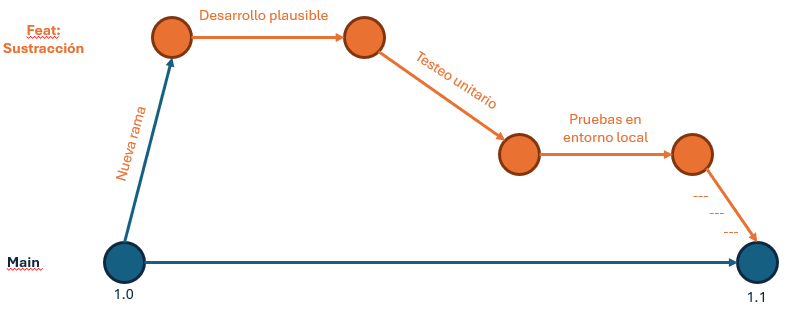
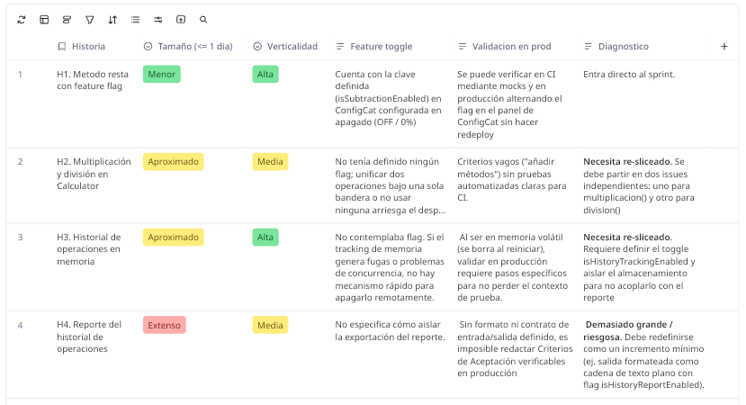

# Scrum + TBD Playbook
**Repositorio:** `D4N-1/git-course`  
**Modalidad:** Individual (Adaptación a un solo desarrollador)

---

## 1. Diagnóstico del Flujo de Trabajo

### Preguntas Clave
- **¿Cuánto vive una rama?**
  En TBD individual, una rama corta vive menos de 24 horas; los cambios mínimos pueden integrarse directamente a `main` tras validación local.
- **¿Con qué frecuencia integras a main?**
  Mínimo 1 o 2 veces al día.
- **¿El DoD garantiza que main sea siempre desplegable?**
  Sí. Nada entra a `main` si rompe la compilación/tests, y cualquier trabajo incompleto se protege mediante Feature Flags.

### Mapa del Flujo Actual y Puntos de Fricción

> *Haz clic en la imagen para abrir el tablero interactivo en Miro.*

---

## 2. Roles Adaptados (Enfoque Individual)

- **Product Owner (PO):**
  - Divide los issues en entregas verticales pequeñas (batches de < 1 día).
  - Define los criterios de aceptación verificables en producción y la estrategia de Feature Flags.
  > **Compromiso (PO):** *"A partir de hoy, no crearé issues monolíticos; desglosaré cada funcionalidad en historias mínimas que puedan viajar a main ocultas tras un flag y validarse en producción sin esperar al final de un sprint."*

- **Developer:**
  - Mantiene `main` siempre verde; si CI falla, detiene el desarrollo nuevo hasta reparar la rama principal.
  - Realiza commits atómicos y agrega pruebas automatizadas que respalden cada cambio.
  > **Compromiso (Developer):** *"A partir de hoy, no acumularé más de un día de trabajo en local ni mantendré ramas vivas por más de 24 horas; integraré cambios pequeños respaldados por tests para garantizar que main sea siempre desplegable."*

- **Scrum Master / Platform:**
  - Configura y hace cumplir las Branch Protection Rules en GitHub.
  - Optimiza los workflows de GitHub Actions para que el pipeline de feedback tarde menos de 5 minutos.
  - Elimina la fricción y el miedo a romper el entorno mediante reversiones rápidas y automatización.
  > **Compromiso (Scrum Master / Platform):** *"A partir de hoy, priorizaré la salud y velocidad del pipeline sobre nuevas características; si el CI tarda demasiado o falla, protegeré el tiempo necesario para arreglar la automatización antes de seguir construyendo."*

---

## 3. Artefactos y Ceremonias Adaptados

### 3.1 Tabla Comparativa (Clásico vs. TBD + CD)

| Artefacto / Ceremonia | Versión clásica | Adaptación TBD + CD |
| :--- | :--- | :--- |
| **Product Backlog** | Lista priorizada de historias | Historias sliceadas + plan de Feature Toggle + AC validables en producción. |
| **Sprint Backlog** | Trabajo del sprint | Trabajo que se planea integrar a `main` (idealmente a diario). |
| **Incremento** | Al final del sprint | Cualquier commit en `main` que pase CI es un Incremento potencial. |
| **Daily Scrum** | Qué hice / haré / impedimentos | Qué voy a integrar hoy a `main` y qué necesito para que sea seguro. |
| **Sprint Review** | Demo del incremento del sprint | Demo de lo que ya está (o puede estar) en producción + feedback real. |
| **Sprint Retrospective** | Mejorar el proceso | Mejorar flujo de valor + salud del pipeline + disciplina de TBD. |

### 3.2 Actividad: Traduce tu Realidad (Historia Reescrita para TBD)

#### Historia de Usuario: HU-01 - Operación Resta con Feature Flag en Calculadora

* **Título:** Implementación del método de sustracción en `Calculator` bajo Flag (Dark Launch).
* **Descripción:**  
  **Como** desarrollador del sistema,  
  **Quiero** integrar la lógica matemática del método `resta()` en la clase `Calculator` (`main.py`) manteniendo la funcionalidad inactiva mediante un Feature Flag en ConfigCat al 0% de rollout,  
  **Para** integrar código frecuentemente a la rama principal (`main`) sin exponer funcionalidades incompletas a los usuarios finales ni generar regresiones en producción.

#### 1. Sliceado Vertical (Estrategia de Batch Pequeño)
- **Tamaño estimado:** < 1 día de trabajo (integrable en menos de 24 horas).
- **Alcance:** Solo lógica interna (`Calculator.resta`) y suite de pruebas unitarias (`tests.py`).
- **Exclusión explícita:** No se modifica la interfaz gráfica / CLI / API expuesta al usuario.

#### 2. Plan de Feature Toggle (ConfigCat)
- **Flag Key:** `isSubtractionEnabled`.
- **Estado inicial:** `OFF` / Desactivado (Rollout al 0% en ConfigCat).
- **Estrategia en código:** El método valida el toggle con el SDK de ConfigCat; si está en `False`, no se expone o retorna error controlado. En `tests.py` se mockea el cliente para verificar ambos estados.

#### 3. Criterios de Aceptación (AC) Validables en Producción / Main
- [ ] **Lógica implementada:** El método `resta(a, b)` está definido en `Calculator` dentro de `main.py` y resuelve sustracciones aritméticas correctamente.
- [ ] **Cobertura de pruebas:** Se añaden casos de prueba en `tests.py` que verifican la resta y el comportamiento dependiente del Feature Flag.
- [ ] **Salud de CI:** El pipeline de GitHub Actions ejecuta el job de pruebas automáticas (`pytest` / `unittest`) y finaliza en verde (`success`).
- [ ] **Dark Launch activo:** La key del Feature Flag existe en el dashboard de ConfigCat configurada en `OFF` (0% de usuarios).
- [ ] **Desplegabilidad garantizada:** El merge a `main` no altera el funcionamiento de ninguna capacidad preexistente de la calculadora en ejecución.

#### 4. Pregunta de Cierre: ¿Cómo cambiarían nuestro Sprint Review y Retrospective con esta forma de trabajar?
* **Sprint Review:**
  - **Antes:** Se esperaba a tener la calculadora terminada con interfaz gráfica para hacer una demo local al final del sprint.
  - **Ahora con TBD + CD:** El incremento ya está en `main` y desplegado. La demostración consiste en ir al dashboard de ConfigCat en vivo, encender `isSubtractionEnabled` y verificar el cambio en staging/producción sin necesidad de hacer redeploy.
* **Sprint Retrospective:**
  - **Antes:** Se discutían bloqueos entre ramas y merge conflicts acumulados.
  - **Ahora con TBD + CD:** La conversación se enfoca en la salud del flujo técnico y la disciplina de entrega (tiempos de CI, ramas de < 24h, estabilidad al alternar flags).

---

## 4. Scrum + TBD Playbook (Reglas del Repositorio)

### Principios Acordados (Máximo 5)
1. `main` siempre está verde y en estado desplegable (*releasable*).
2. Ramas cortas con vida menor a 24 horas.
3. Lo incompleto viaja a `main` protegido tras Feature Toggles.
4. Pipeline roto es prioridad cero: se detiene el trabajo nuevo hasta reparar `main`.
5. Commits pequeños, atómicos y con trazabilidad al issue.

### Reglas de Oro de Integración a Main
- Todo merge requiere paso obligatorio y en verde del pipeline de CI (Linter + Tests + Build).
- Historial lineal (Squash and Merge o Rebase) para facilitar reversiones inmediatas si algo falla.
- Ningún cambio de esquema o lógica base debe romper la versión previa (retrocompatibilidad obligatoria).

### Definition of Done (DoD) Preliminar

#### Criterios Técnicos:
- [ ] Código formateado y libre de errores de linter.
- [ ] Pruebas unitarias/integración añadidas con cobertura del nuevo cambio.
- [ ] Pipeline de CI en verde en GitHub Actions.
- [ ] Docker build y empaquetado finalizados sin errores críticos.

#### Criterios de Negocio:
- [ ] Criterios de Aceptación del issue validados.
- [ ] Feature Toggle configurado correctamente para permitir despliegue seguro sin exponer código incompleto.
- [ ] Funcionalidad verificada en el entorno de despliegue o staging.

### Adaptación de Ceremonias (Rutina Individual)
- **Daily:** Revisión diaria de 2 min: *"¿Qué commit/PR integro a main hoy y qué tests garantizan que sea seguro?"*
- **Review:** Demostración del software funcionando en el entorno real con activación controlada de toggles.
- **Retro:** Análisis semanal del flujo: ¿cuántos builds fallaron?, ¿alguna rama tardó más de un día?, ¿el pipeline fue lo bastante rápido?

### Decisiones Pendientes
- [ ] Evaluar proveedor o método de Feature Toggles (variables de entorno `.env` vs. herramientas como ConfigCat / Unleash).
- [ ] Implementar métricas DORA básicas (Frecuencia de Despliegue y Tiempo de Recuperación ante Fallos).
- [ ] Optimizar la caché de dependencias en GitHub Actions para asegurar un CI de menos de 3 minutos.

---

## 5. Diagnóstico y Salud del Backlog (TBD-Friendly)

### Evaluación de Historias del Repositorio
| Historia / Issue | Tamaño ($\le$ 1 día) | Verticalidad (Valor autónomo) | Feature Toggle | Validación en Producción | Estado y Diagnóstico |
| :--- | :---: | :---: | :---: | :---: | :--- |
| **H1. Método resta con Feature Flag** | 🟢 | 🟢 | 🟢 | 🟢 | **Lista para TBD** |
| **H2. Multiplicación y división en `Calculator`** | 🟡 | 🟡 | 🔴 | 🔴 | **Necesita re-sliceado** *(acopla dos operaciones sin toggles ni tests)* |
| **H3. Historial de operaciones en memoria** | 🟡 | 🟢 | 🔴 | 🟡 | **Necesita re-sliceado** *(falta toggle y aislar persistencia volátil)* |
| **H4. Generar reporte del historial** | 🔴 | 🟡 | 🔴 | 🔴 | **Demasiado grande / riesgosa** *(depende de H3; no define formato)* |

---

## 6. Definition of Ready (DoR) para TBD

Un ítem o historia está estrictamente listo para entrar al sprint si cumple:
- [ ] **Tamaño reducido:** Sliceado verticalmente para integrarse a `main` en $\le$ 24 horas.
- [ ] **Criterios de Aceptación verificables:** Definidos para ser probados tras el despliegue en producción o staging.
- [ ] **Estrategia de Feature Toggle definida:** Se especifica si requiere flag, la clave del toggle en ConfigCat y su estado por defecto (`OFF`).
- [ ] **Sin bloqueos externos:** No depende de tareas inconclusas de otras ramas ni de dependencias externas.
- [ ] **Validación clara:** Se comprende con exactitud cómo se probará en el pipeline de CI y en producción.

---

## 7. Planificación del Sprint Orientada al Flujo

### Reglas de Orden y Capacidad
- **Primer ítem del sprint:** Debe poder integrarse a `main` el Día 1 o Día 2 de trabajo.
- **Criterio de orden:** Prioridad basada en valor + menor riesgo de despliegue + dependencia secuencial.
- **Ajuste de capacidad:** La planificación descuenta tiempos de ejecución del pipeline de CI, pruebas automáticas y resolución de posibles roturas de `main`.

### Sprint Goal (Orientado a TBD)
> *"Al final del sprint, los usuarios podrán ejecutar sustracciones y multiplicaciones validadas en producción, mientras que la división, el historial volátil y los reportes permanecerán protegidos tras Feature Toggles inactivos."*

### Cronograma de Integración Diaria
- **Día 1–2:** 
  - Integrar H1: Método `resta()` + tests + toggle `isSubtractionEnabled` apagado.
  - Integrar Incremento 2.1: Método `multiplicar()` + tests + toggle `isMultiplicationEnabled` apagado.
- **Día 3–4:** 
  - Integrar Incremento 2.2: Método `dividir()` con control de división por cero + tests + toggle `isDivisionEnabled` apagado.
  - Integrar Incremento 3.1: Estructura de historial volátil en memoria + tests + toggle `isHistoryTrackingEnabled` apagado.
- **Día 5+:** 
  - Integrar Incremento 4.1: Reporte formateado en texto + tests.
  - Activación gradual de toggles en ConfigCat para validación funcional en producción.

---

## 8. Historias Re-sliceadas para GitHub Issues

### Issue #02: Implementar método `multiplicacion()` bajo Feature Flag
* **Historia:**  
  **Como** usuario de la calculadora,  
  **Quiero** realizar multiplicaciones numéricas directas en `Calculator`,  
  **Para** calcular productos matemáticos con pruebas automáticas confiables.
* **Integrable en $\le$ 1 día:** Sí (~2 horas).
* **Feature Toggle:** `isMultiplicationEnabled` (ConfigCat, `OFF` / Rollout 0%).
* **Acceptance Criteria (AC):**
  - [ ] Método `multiplicar(a, b)` implementado en `Calculator` (`main.py`).
  - [ ] Pruebas unitarias en `tests.py` validan factores positivos, negativos y producto por cero.
  - [ ] CI pasa en verde con el flag configurado; con flag en `False` la funcionalidad no se expone.

### Issue #03: Implementar método `division()` con validación por cero
* **Historia:**  
  **Como** usuario de la calculadora,  
  **Quiero** ejecutar divisiones aritméticas con control de errores ante divisor cero,  
  **Para** evitar excepciones no controladas en tiempo de ejecución.
* **Integrable en $\le$ 1 día:** Sí (~2 horas).
* **Feature Toggle:** `isDivisionEnabled` (ConfigCat, `OFF` / Rollout 0%).
* **Acceptance Criteria (AC):**
  - [ ] Método `dividir(a, b)` implementado en `Calculator` (`main.py`).
  - [ ] Si `b == 0`, lanza `ZeroDivisionError` controlado.
  - [ ] Pruebas unitarias en `tests.py` cubren divisiones estándar y división por cero en CI.

### Issue #04: Registro en memoria de historial volátil de operaciones
* **Historia:**  
  **Como** usuario de la calculadora,  
  **Quiero** que el sistema almacene en memoria las operaciones exitosas de la sesión,  
  **Para** auditar los cálculos recientes sin persistencia permanente en disco.
* **Integrable en $\le$ 1 día:** Sí (~3 horas).
* **Feature Toggle:** `isHistoryTrackingEnabled` (ConfigCat, `OFF` / Rollout 0%).
* **Acceptance Criteria (AC):**
  - [ ] Estructura en memoria interna que almacena `{operacion, a, b, resultado}`.
  - [ ] Las operaciones registran cálculo solo si el flag está activo.
  - [ ] Método `obtener_historial()` retorna los registros; al reiniciar el programa la memoria inicia vacía.
  - [ ] Tests unitarios en `tests.py` verifican el ciclo de vida en memoria.

### Issue #05: Generar reporte formateado de historial de operaciones
* **Historia:**  
  **Como** usuario de la calculadora,  
  **Quiero** generar un resumen textual legible del historial de la sesión,  
  **Para** exportar o revisar los cálculos efectuados sin inspeccionar datos en crudo.
* **Integrable en $\le$ 1 día:** Sí (~3 horas).
* **Feature Toggle:** `isHistoryReportEnabled` (ConfigCat, `OFF` / Rollout 0%).
* **Acceptance Criteria (AC):**
  - [ ] Método `generar_reporte(formato="texto")` implementado.
  - [ ] Si el historial está vacío, devuelve un aviso controlado indicando la ausencia de datos.
  - [ ] Retorna un formato legible con el total de operaciones calculadas.
  - [ ] Pruebas automáticas en CI verifican casos con y sin historial.

---

## 9. Acciones Concretas para la Próxima Planning

1. Ningún issue entra al Sprint Backlog sin validar los 4 criterios de salud TBD y contar con DoR aprobado.
2. Crear la clave del Feature Toggle en ConfigCat en estado `OFF` antes de comenzar el código de cualquier batch.
3. Proteger la cadencia de integración continua deteniendo nuevo desarrollo si el pipeline de CI en `main` se encuentra en rojo[cite: 1, 2].